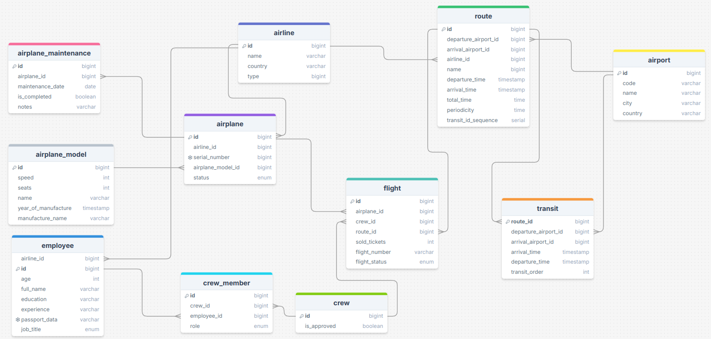

# Отчет по лабораторной работе
---

## Цель работы

Реализация серверной части приложения средствами django и djangorestframework

---

## Задачи   
1. Реализовать модель базы данных средствами DjangoORM.  
2. Реализовать логику работу API средствами Django REST Framework (используя методы сериализации).
3. Подключить регистрацию / авторизацию по токенам / вывод информации о текущем пользователе средствами Djoser.  

---

## Ход работы  

### 1. Реализация моделей  
Составлена следующая модель базы данных, которая реализована в models.py



### 2. Реализация функционала
**serializers** – отвечает за сериализацию данных. Добавили базовые сериализотры, для всех моделей и всех их полей.

**Views** – отвечает за функционал работы пользователя с ендпоинтами  
- **AirlineViewSet** - выводит полную информацию о каждой авиалинии. 
    
    Ендпоинт: http://127.0.0.1:8000/api/airlines/

- **AirportViewSet** - выводит полную информацию о каждом аэропорте. 

    Ендпоинт:http://127.0.0.1:8000/api/airports/
  - `def traffic(self, request, pk=None)` - возвращает количество рейсов (вылетов и прилетов) для указанного аэропорта.
    
      Ендпоинт: http://127.0.0.1:8000/api/airports/{id}/traffic/

- **RouteViewSet:** - выводит полную информацию о каждом маршруте. 

    Ендпоинт: http://127.0.0.1:8000/api/routes/
  - `def with_transits(self, request)` - возвращает маршруты с указанием пересадок для каждого маршрута. 
  
      Ендпоинт: http://127.0.0.1:8000/api/routes/with_transits/
  - `def total_travel_time(self, request, pk=None)` - вычисляет общее время в пути для указанного маршрута, включая пересадки.
  
      Ендпоинт: http://127.0.0.1:8000/api/routes/{id}/total_travel_time/
  - `def load_analysis(self, request)` - возвращает маршруты с их загруженностью (количество проданных билетов относительно доступных мест в самолетах).
  
      Ендпоинт: http://127.0.0.1:8000/api/routes/load_analysis/

- **TransitViewSet** - выводит полную информацию о пересадках. 

    Ендпоинт: http://127.0.0.1:8000/api/transits/

- **AirplaneModelViewSet** - возвращает полную информацию о каждой модели самолета. 

    Ендпоинт: http://127.0.0.1:8000/api/airplane_models/

- **AirplaneViewSet** - возвращает полную информацию о каждом самолете. 

    Ендпоинт: http://127.0.0.1:8000/api/airplanes/
  - `def maintenance_history(self, request, pk=None)` - возвращает полную историю технического обслуживания для указанного самолета. 
  
      Ендпоинт: http://127.0.0.1:8000/api/airplanes/{id}/maintenance_history/
  - `def stats(self, request)` - возвращает статистику по самолетам для указанной авиалинии: общее количество самолетов, их статус и модели.
  
      Ендпоинт: http://127.0.0.1:8000/api/airplanes/stats/?airline_id={id}
  - `def availability(self, request)` - проверяет, доступен ли самолет для указанного рейса.
  
      Ендпоинт: http://127.0.0.1:8000/api/airplanes/availability/?airplane_id={id}&departure_time={dep_time}&arrival_time={arr_time}

- **AirplaneMaintenanceViewSet** - возвращает полную информацию о каждом обслуживании самолета. 

    Ендпоинт: http://127.0.0.1:8000/api/airplane_maintenance/
  - `def scheduled_for_month(self, request)` - возвращает самолеты, у которых обслуживание запланировано на указанный месяц.
  
      Ендпоинт: http://127.0.0.1:8000/api/airplane_maintenance/scheduled_for_month/?year={yyyy}&month={mm}

- **EmployeeViewSet** - выводит полную информацию о каждом работнике. 

    Ендпоинт: http://127.0.0.1:8000/api/employees/
  - `def by_experience(self, request)` - возвращает список сотрудников с фильтрацией по опыту работы. 
  
      Ендпоинт: http://127.0.0.1:8000/api/employees/by_experience/?min_experience={минимальный_опыт}
  - `def by_role(self, request)` - возвращает список сотрудников авиалинии по указанной должности.
  
      Ендпоинт: http://127.0.0.1:8000/api/employees/by_role/?airline_id={id_авиалинии}&role={должность}

- **CrewViewSet** - возвращает полную информацию о каждом экипаже. 

    Ендпоинт: http://127.0.0.1:8000/api/crews/
  - `def flights(self, request, pk=None)` - возвращает список рейсов, закрепленных за указанным экипажем. 
  
      Ендпоинт: http://127.0.0.1:8000/api/crews/{id_экипажа}/flights/
  - `def with_members(self, request)` - возвращает список всех экипажей с подробной информацией о каждом члене.
  
      Ендпоинт: http://127.0.0.1:8000/api/crews/with_members/

- **CrewMemberViewSet** - выводит полную информацию о членах каждого экипажа.

    Ендпоинт: http://127.0.0.1:8000/api/crew_members/

- **FlightViewSet** - выводит полную информацию о каждом рейсе. 

    Ендпоинт: http://127.0.0.1:8000/api/flights/
  - `def nearest(self, request)` - возвращает ближайшие рейсы для указанного аэропорта.
  
      Ендпоинт: http://127.0.0.1:8000/api/flights/nearest/?airport_code={код_аэропорта}
  - `def status_summary(self, request)` - возвращает текущий статус рейсов (по состоянию на сегодня) с указанием количества рейсов в каждом статусе.
  
      Ендпоинт: http://127.0.0.1:8000/api/flights/status_summary/
  - `def search(self, request)` - возвращает рейсы, отфильтрованные по аэропорту отправления, аэропорту прибытия и дате.
  
      Ендпоинт: http://127.0.0.1:8000/api/flights/search/?departure_airport={code}&arrival_airport={code}&date={yyyy-mm-dd}

**urls** - url регистрировали с помощью **DefaultRouter** (позволяет регистрировать пути для всех CRUD запросов и 
регистрирует кастомные запросы, определенные через декоратор **@action** внутри класса ModelViewSet):
```python
router = DefaultRouter()
router.register(r'models', ModelViewSet) # пример

urlpatterns = [
    path('api/', include(router.urls)),
]
```

### 3. Djoser

Добавили `'djoser'` в `settings.INSTALLED_APPS`, а также добавили следующий код:

```python
# Настройки Djoser
DJOSER = {
    'LOGIN_FIELD': 'username',
    'EMAIL': 'email',
    'USER_CREATE_PASSWORD_RETYPE': True,  # повторный ввод пароля при регистрации
    'SEND_ACTIVATION_EMAIL': False,  # отправка писем активации
    'SERIALIZERS': {
        'user': 'djoser.serializers.UserSerializer',
        'current_user': 'djoser.serializers.UserSerializer',
    },
}

# Настройки JWT

SIMPLE_JWT = {
    'ACCESS_TOKEN_LIFETIME': timedelta(minutes=60),  # Время жизни токена
    'REFRESH_TOKEN_LIFETIME': timedelta(days=1),
    'AUTH_HEADER_TYPES': ('Bearer',),
}
```

### Заключение
У нас есть теперь собственный API, который доступен только после регистрации и аутентификации