# Отчет по практической работе №3.1

---

## Задачи   
1. Написать запрос на создание 6-7 новых автовладельцев и 5-6 автомобилей, каждому автовладельцу назначьте удостоверение и от 1 до 3 автомобилей.  Результатом должны стать запросы и отображение созданных объектов. 
Если добавляете автомобили владельцу через метод .add(), не забудьте заполнить также ассоциативную сущность “владение”2. Реализовать функционал добавления, редактирования и удаления данных.   
2. По созданным данным написать запросы на фильтрацию.
3. Необходимо реализовать следующие запросы c применением агрегации и аннотации.
---

## Ход работы  

### 1. Вставляем данные 
Написали код для создания и добавления данных и реализовали через интерактивный режим.

**Код**

```python
from datetime import datetime
from blog.models import User, Owner, Car, Ownership, DriverLicense

# Создание пользователей
user1 = User.objects.create_user(
    username="ivan_petrov", 
    password="securePass123", 
    passport_number="4812567890", 
    address="г. Москва, ул. Арбат, д. 10", 
    nationality="Россия"
)
user2 = User.objects.create_user(
    username="anna_smirnova", 
    password="securePass123", 
    passport_number="5723689012", 
    address="г. Санкт-Петербург, пр. Невский, д. 20", 
    nationality="Россия"
)
user3 = User.objects.create_user(
    username="sergey_ivanov", 
    password="securePass123", 
    passport_number="6934789023", 
    address="г. Казань, ул. Баумана, д. 5", 
    nationality="Россия"
)
user4 = User.objects.create_user(
    username="maria_komarova", 
    password="securePass123", 
    passport_number="7045890123", 
    address="г. Новосибирск, ул. Красный проспект, д. 15", 
    nationality="Россия"
)
user5 = User.objects.create_user(
    username="dmitry_fedorov", 
    password="securePass123", 
    passport_number="8156901234", 
    address="г. Екатеринбург, ул. 8 Марта, д. 7", 
    nationality="Россия"
)
user6 = User.objects.create_user(
    username="olga_stepanova", 
    password="securePass123", 
    passport_number="9267012345", 
    address="г. Владивосток, ул. Светланская, д. 12", 
    nationality="Россия"
)

# Создание автомобилей
car1 = Car.objects.create(license_plate="A111AA77", brand="BMW", model="X5", color="Черный")
car2 = Car.objects.create(license_plate="B222BB77", brand="Mercedes", model="C-Class", color="Белый")
car3 = Car.objects.create(license_plate="C333CC77", brand="Audi", model="A4", color="Серый")
car4 = Car.objects.create(license_plate="D444DD77", brand="Volkswagen", model="Passat", color="Синий")
car5 = Car.objects.create(license_plate="E555EE77", brand="Volvo", model="XC60", color="Красный")
car6 = Car.objects.create(license_plate="F666FF77", brand="Toyota", model="RAV4", color="Зеленый")

# Создание водительских удостоверений и связывание с владельцами
owners = [user1, user2, user3, user4, user5, user6]
cars = [car1, car2, car3, car4, car5, car6]

for i, user in enumerate(owners):
    DriverLicense.objects.create(
        owner=user,
        license_number=f"DL{i+1}67890",
        license_type="B",
        issue_date=datetime(2020 + i, 5, 10)
    )
    # Назначение автомобилей
    owned_cars = cars[i % len(cars):i % len(cars) + 2]  # Берём до 2 автомобилей, начиная с текущего индекса
    for car in owned_cars:
        Ownership.objects.create(
            owner=user,
            car=car,
            start_date=datetime(2021 + i, 3, 15)
        )

# Отображение созданных объектов
print("Пользователи:")
for user in User.objects.all():
    print(user)

print("\nАвтомобили:")
for car in Car.objects.all():
    print(car)

print("\nВодительские удостоверения:")
for license in DriverLicense.objects.all():
    print(license)

print("\nВладения:")
for ownership in Ownership.objects.all():
    print(ownership)
```

**Вывод**

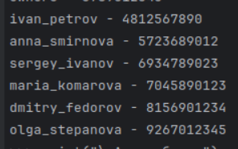

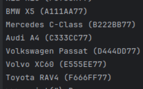

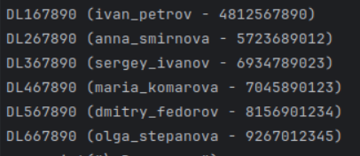

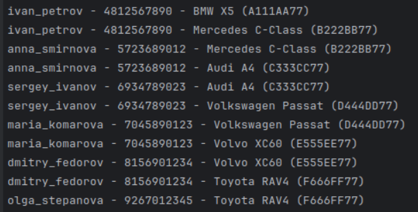

### 2. Фильтрация 
* Выведете все машины марки “Toyota” (или любой другой марки, которая у вас есть)

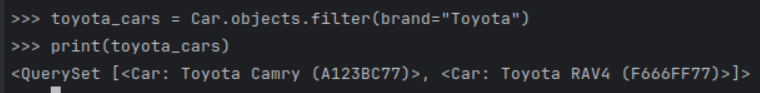

* Найти всех водителей с именем “Олег” (или любым другим именем на ваше усмотрение)

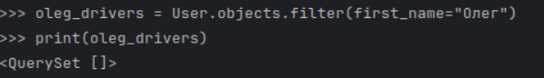

* Взяв любого случайного владельца получить его id, и по этому id получить экземпляр удостоверения в виде объекта модели (можно в 2 запроса)

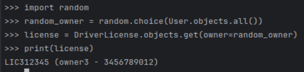

* Вывести всех владельцев красных машин (или любого другого цвета, который у вас присутствует)

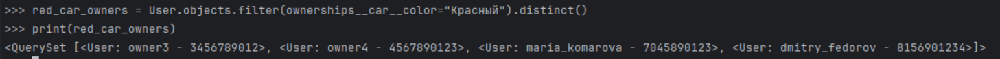

* Найти всех владельцев, чей год владения машиной начинается с 2010 (или любой другой год, который присутствует у вас в базе)

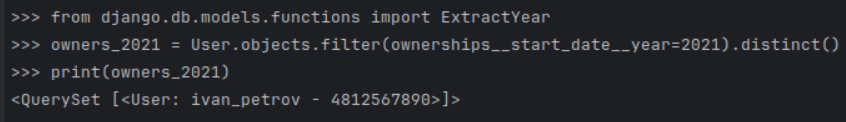

### 3. Агрегация и аннотация запросов

* Вывод даты выдачи самого старшего водительского удостоверения

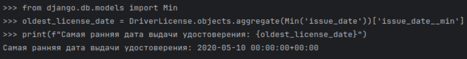

* Укажите самую позднюю дату владения машиной, имеющую какую-то из существующих моделей в вашей базе

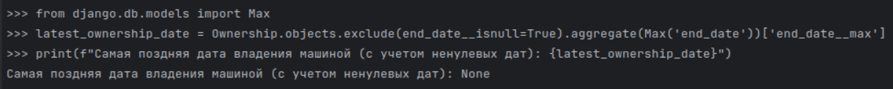

* Выведите количество машин для каждого водителя

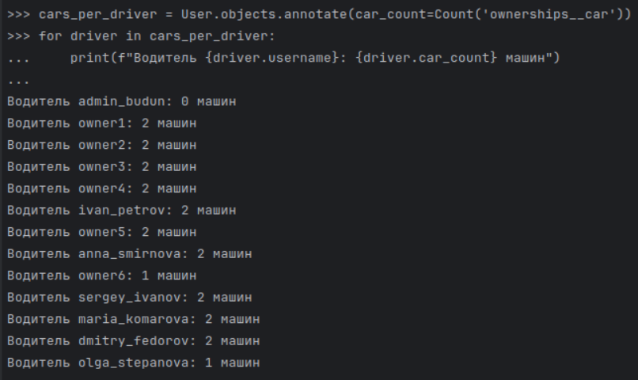

* Подсчитайте количество машин каждой марки

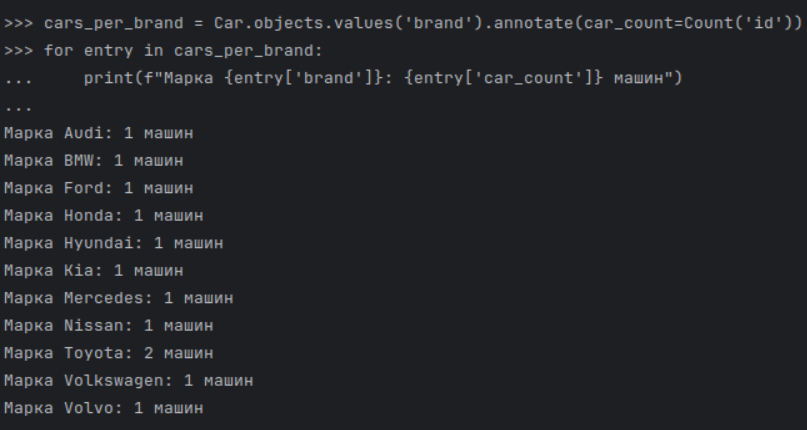

* Отсортируйте всех автовладельцев по дате выдачи удостоверения

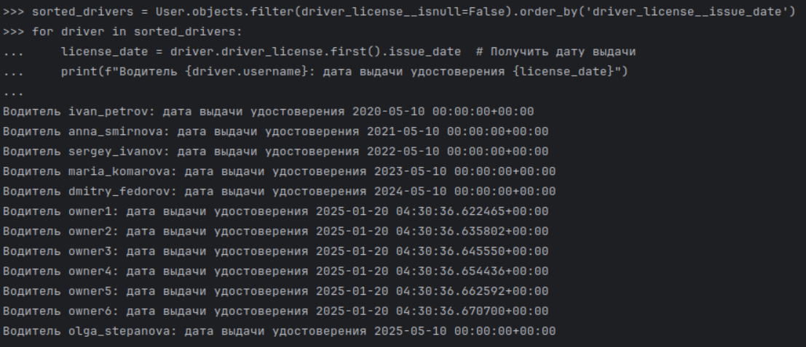
