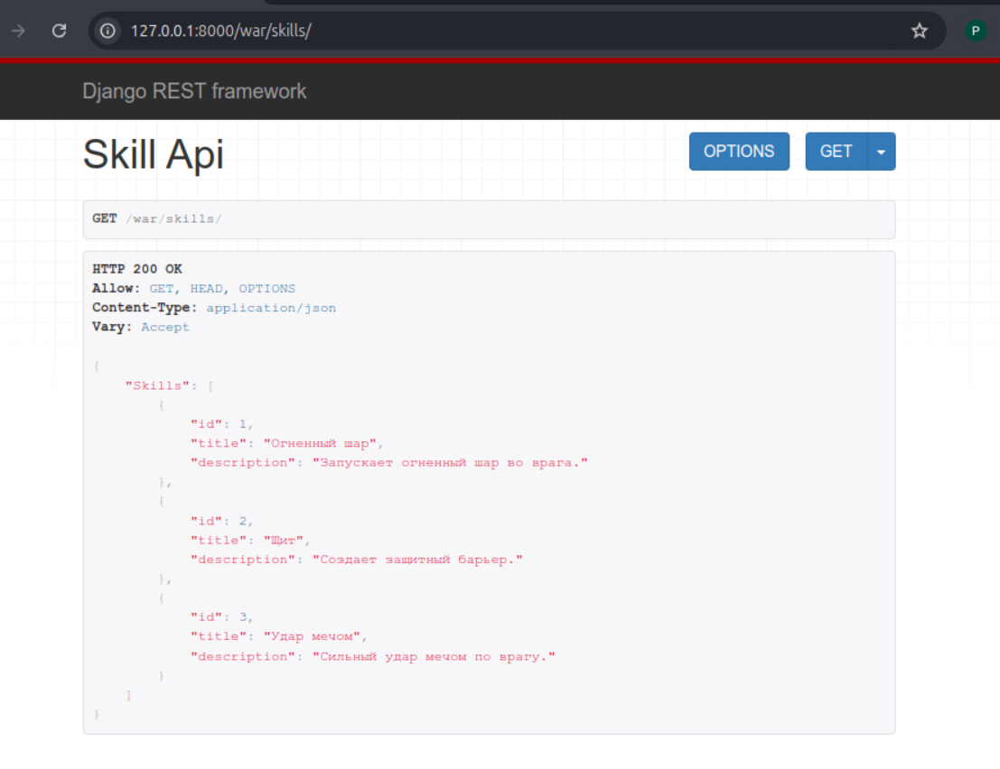
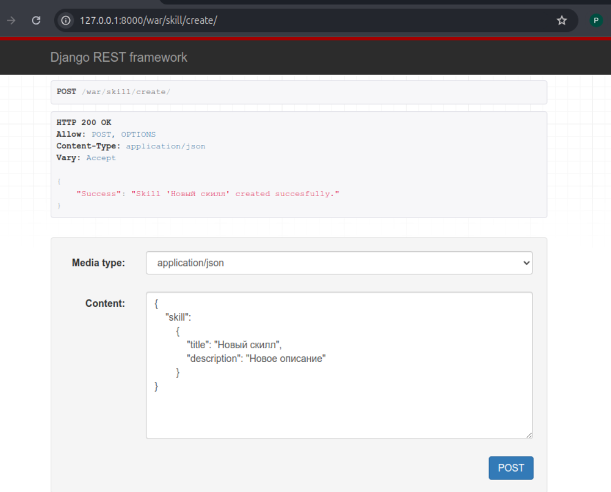
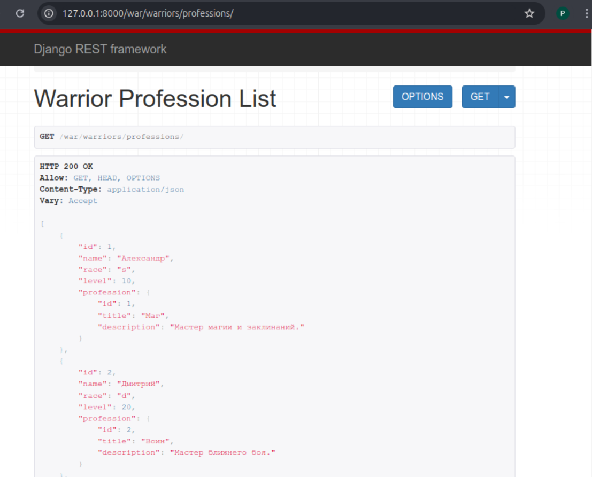
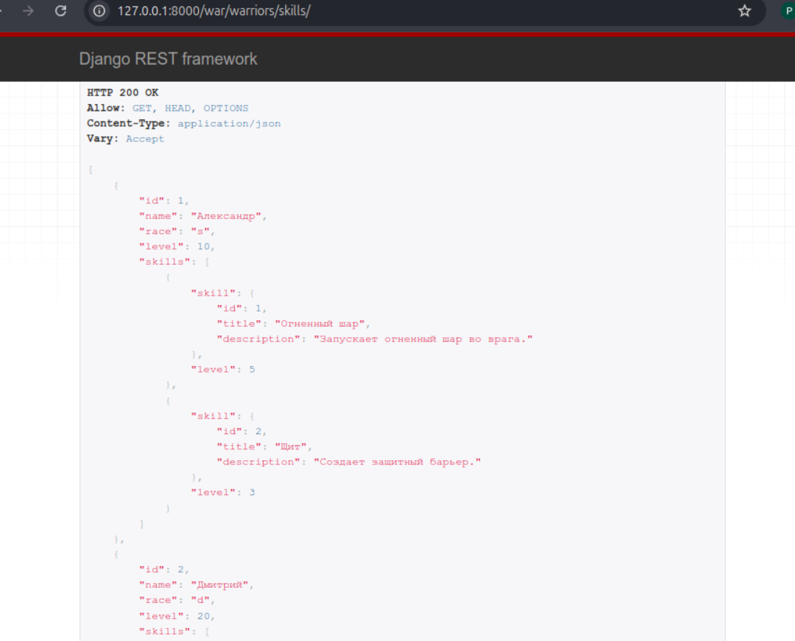
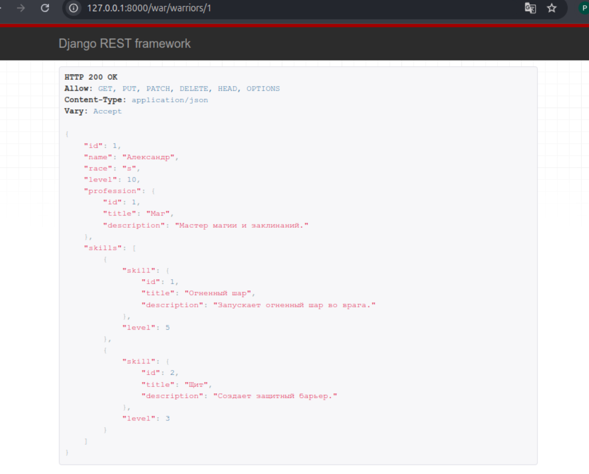
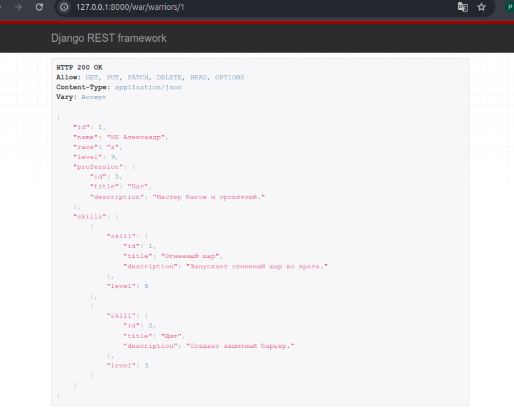
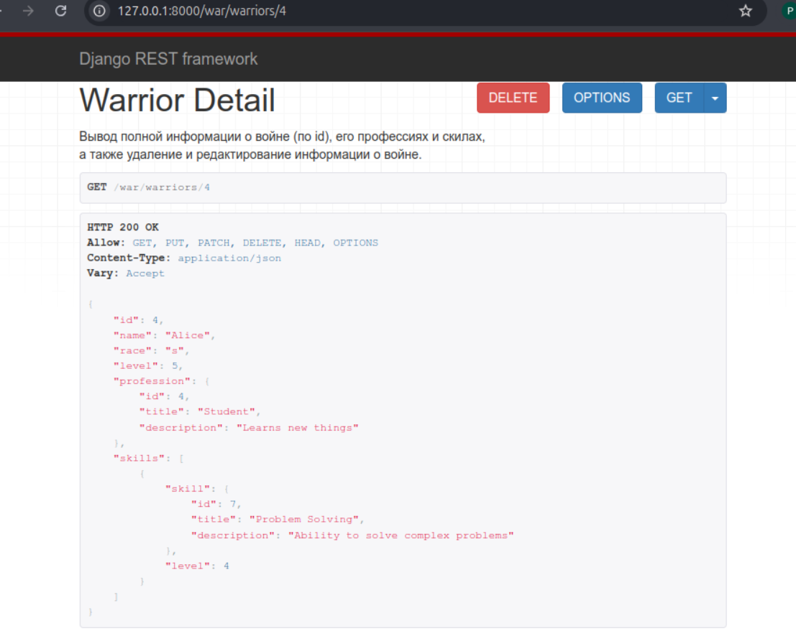
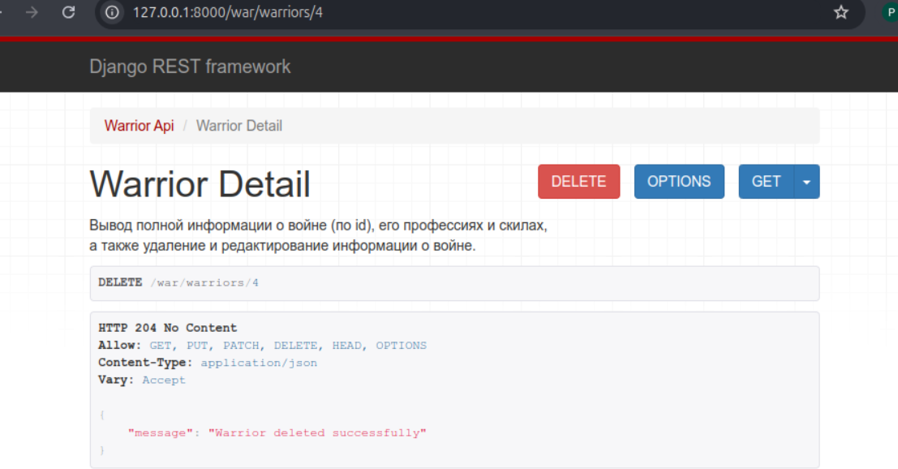

# Отчет по практической работе №3.2

---

## Ход работы

### Реализовать ендпоинты для добавления и просмотра скиллов

Добавили следующий код в serializers.py:

    '''python
    class SkillSerializer(serializers.ModelSerializer):
    
      class Meta:
         model = Skill
         fields = "__all__"
    
    class SkillCreateSerializer(serializers.Serializer):
        title = serializers.CharField(max_length=120)
        description = serializers.CharField()
    
        def create(self, validated_data):
           skill = Skill(**validated_data)
           skill.save()
           return skill
    '''

Добавили следующий код в views.py:

    '''python
    class SkillAPIView(APIView):
        def get(self, request):
            skills = Skill.objects.all()
            serializer = WarriorSerializer(skills, many=True)
            return Response({"Skills": serializer.data})
    
    class SkillCreateView(APIView):
    
       def post(self, request):
           skill = request.data.get("skill")
           serializer = SkillCreateSerializer(data=skill)
    
           if serializer.is_valid(raise_exception=True):
               skill_saved = serializer.save()
    
           return Response({"Success": "Skill '{}' created succesfully.".format(skill_saved.title)})
    '''

Добавили следующий код в urls.py:

    '''python
    path('/skills/', SkillAPIView.as_view()),
    path('skill/create/', SkillCreateView.as_view()),
    '''

Проверка работы:

### Вывод полной информации о всех воинах и их профессиях (в одном запросе).

Добавили следующий код в serializers.py:

    '''python
    class WarriorProfessionSerializer(serializers.ModelSerializer):
        profession = ProfessionSerializer()
    
        class Meta:
            model = Warrior
            fields = ['id', 'name', 'race', 'level', 'profession']
    '''

Добавили следующий код в views.py:

    '''python
    class WarriorProfessionListView(ListAPIView):
        queryset = Warrior.objects.select_related('profession').all()
        serializer = WarriorProfessionSerializer
    '''

Добавили следующий код в urls.py:

    '''python
    path('warriors/professions/', WarriorProfessionListView.as_view()),
    '''

Проверка работы:

### Вывод полной информации о всех воинах и их скиллах (в одном запросе).

Добавили следующий код в serializers.py:

    '''python
    class WarriorSkillsSerializer(serializers.ModelSerializer):
        skills = SkillOfWarriorSerializer(source='skillofwarrior_set', many=True)
    
        class Meta:
            model = Warrior
            fields = ['id', 'name', 'race', 'level', 'skills']
    '''

Добавили следующий код в views.py:

    '''python
    class WarriorSkillsListView(ListAPIView):
        queryset = Warrior.objects.prefetch_related('skill').all()
        serializer_class = WarriorSkillsSerializer
    '''

Добавили следующий код в urls.py:

    '''python
    path('warriors/skills/', WarriorSkillsListView.as_view()),
    '''

Проверка работы:

### Вывод полной информации о воине (по id), его профессиях и скиллах.

Добавили следующий код в serializers.py:

    '''python
    class WarriorDetailSerializer(serializers.ModelSerializer):
        profession = ProfessionSerializer()
        skills = SkillOfWarriorSerializer(source='skillofwarrior_set', many=True)
    
        class Meta:
            model = Warrior
            fields = ['id', 'name', 'race', 'level', 'profession', 'skills']
    
        def update(self, instance, validated_data):
            # Обновляем простые поля
            instance.name = validated_data.get('name', instance.name)
            instance.race = validated_data.get('race', instance.race)
            instance.level = validated_data.get('level', instance.level)
    
            # Обновляем профессию
            profession_data = validated_data.pop('profession', None)
            if profession_data:
                profession, _ = Profession.objects.get_or_create(**profession_data)
                instance.profession = profession
    
            # Обновляем навыки
            skills_data = validated_data.pop('skillofwarrior_set', [])
            if skills_data:
                # Удаляем старые записи навыков
                instance.skillofwarrior_set.all().delete()
                # Создаем новые записи навыков
                for skill_data in skills_data:
                    skill_info = skill_data.pop('skill')
                    skill, _ = Skill.objects.get_or_create(**skill_info)
                    SkillOfWarrior.objects.create(
                        warrior=instance,
                        skill=skill,
                        level=skill_data.get('level', 0)
                    )
    
            instance.save()
            return instance
    '''

Добавили следующий код в views.py:

    '''python
    class WarriorDetailView(RetrieveUpdateDestroyAPIView):
        """
        Вывод полной информации о войне (по id), его профессиях и скилах,
        а также удаление и редактирование информации о войне.
        """
        queryset = Warrior.objects.select_related('profession').prefetch_related('skill')
        serializer_class = WarriorDetailSerializer
    
        def delete(self, request, *args, **kwargs):
            instance = self.get_object()
            self.perform_destroy(instance)
            return Response({'message': 'Warrior deleted successfully'}, status=HTTP_204_NO_CONTENT)
    '''

Добавили следующий код в urls.py:

    '''python
    path('warriors/<int:pk>', WarriorDetailView.as_view()),
    '''

Проверка работы:

### Редактирование информации о воине.

Проверка работы:

### Удаление воина по id.

Проверка работы:

